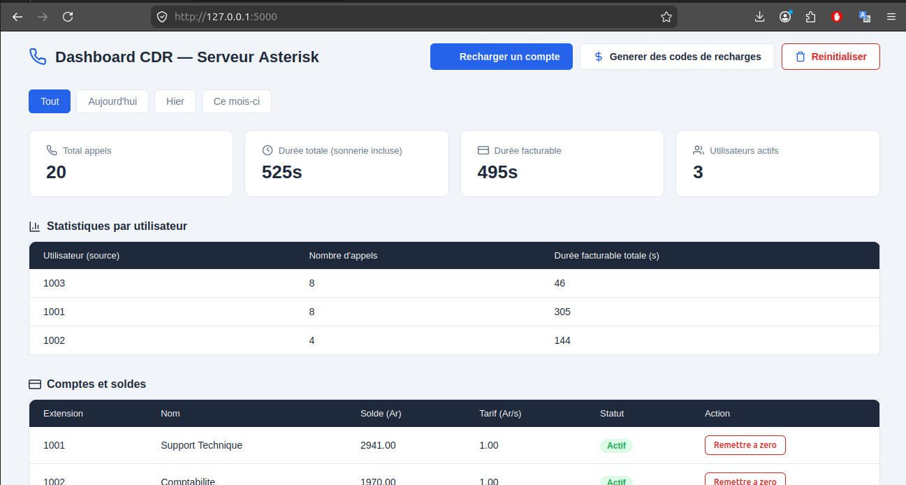
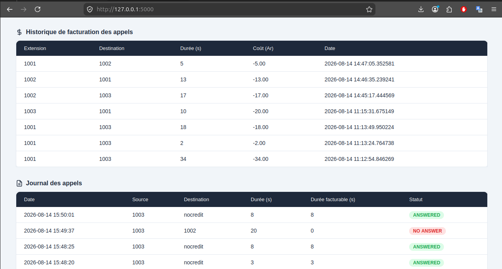
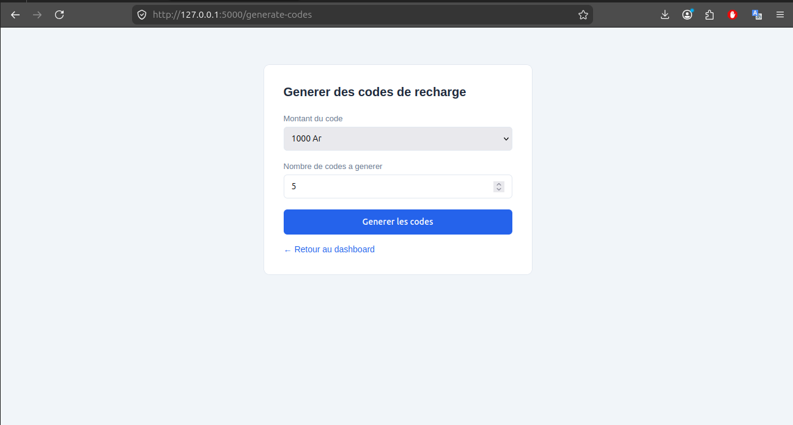
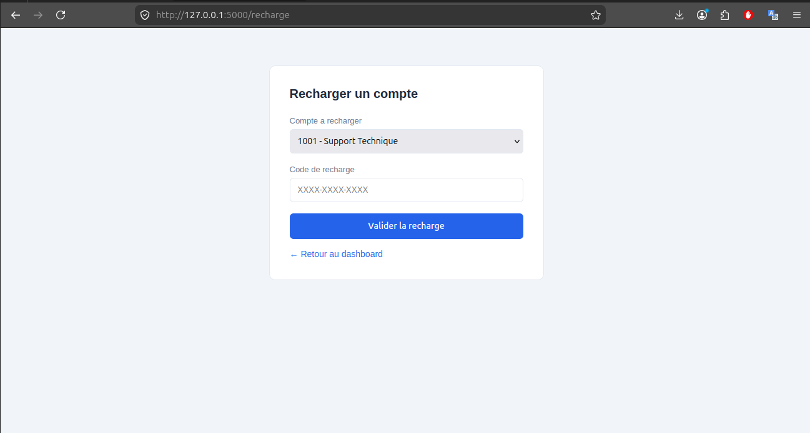

# 📞 Serveur VoIP Asterisk avec Billing Temps Réel et IVR

Système de téléphonie IP complet basé sur **Asterisk**, incluant appels internes, conférence, journalisation des appels (CDR), système de facturation prépayée avec recharge par code, et serveur vocal interactif (IVR) en malgache.

Projet développé sur **Ubuntu 26.04 LTS**, conçu comme une alternative légère et sur-mesure à A2Billing, entièrement bâtie sur **PostgreSQL**.

---

## Sommaire

- [Fonctionnalités](#fonctionnalités)
- [Architecture](#architecture)
- [Stack technique](#stack-technique)
- [Structure du projet](#structure-du-projet)
- [Installation](#installation)
- [Configuration](#configuration)
- [Utilisation](#utilisation)
- [Captures d'écran](#captures-décran)
- [Limitations connues](#limitations-connues)
- [Licence](#licence)

---
## Captures d'écran







---

## Fonctionnalités

### Téléphonie
- Communication audio entre utilisateurs via **PJSIP**
- Conférence multi-utilisateurs (3+) via **ConfBridge**
- Compatible avec les softphones SIP standards (testé avec Linphone)

### Journalisation des appels (CDR)
- Enregistrement automatique de chaque appel dans **PostgreSQL** (source, destination, durée, statut)
- Dashboard web pour consulter le journal, filtrable par période (aujourd'hui / hier / ce mois-ci)
- Statistiques par utilisateur (nombre d'appels, durée cumulée)

### Facturation prépayée (billing)
- Système de compte avec solde en Ariary (Ar), tarif configurable par utilisateur (Ar/seconde)
- Génération de codes de recharge à usage unique (1000 / 2000 / 5000 Ar), stockés **hachés (SHA-256)** en base — jamais en clair
- Vérification du solde **avant** chaque appel (via script AGI), avec limitation automatique de la durée selon le crédit disponible
- Déduction du crédit en temps réel **après** chaque appel, avec historique complet
- Message vocal automatique en cas de solde insuffisant
- Interface web pour recharger un compte, générer des lots de codes (export fichier `.txt`), et réinitialiser les données

### IVR (Serveur Vocal Interactif)
- Menu vocal en **malgache** (enregistrements audio personnalisés)
- Redirection vers : support technique, service commercial, saisie manuelle de numéro de compte
- Présentation des services
- Gestion des choix invalides avec nombre de tentatives limité

---

## Architecture

```
                    ┌─────────────────┐
   Softphones  ───▶ │  Asterisk (PJSIP)│
   (Linphone)       └────────┬─────────┘
                              │
                 ┌────────────┼────────────┐
                 ▼            ▼            ▼
           Dialplan       AGI Scripts   ConfBridge
         (extensions.conf) (billing)    (conférence)
                 │            │
                 ▼            ▼
              ┌──────────────────┐
              │   PostgreSQL      │
              │  (asteriskdb)     │
              │  - cdr            │
              │  - billing_*      │
              │  - recharge_*     │
              └────────┬──────────┘
                        │
                        ▼
              ┌──────────────────┐
              │  Dashboard Flask  │
              │  (CDR + billing)  │
              └──────────────────┘
```

---

## Stack technique

| Composant | Technologie |
|---|---|
| PBX / téléphonie | Asterisk 22 (PJSIP, ConfBridge) |
| Base de données | PostgreSQL |
| Logique de facturation | Python (AGI - Asterisk Gateway Interface) |
| Dashboard web | Python (Flask) + Jinja2 |
| Système d'exploitation | Ubuntu 26.04 LTS |
| Softphone testé | Linphone |

---

## Structure du projet

```
voip-asterisk-project/
├── asterisk-configs/
│   ├── pjsip.conf.example
│   ├── extensions.conf.example
│   ├── confbridge.conf.example
│   └── cdr_pgsql.conf.example
├── billing-scripts/
│   ├── generate_codes.py       # Génération de codes de recharge
│   └── redeem_code.py          # Utilisation d'un code (ligne de commande)
├── agi-scripts/
│   ├── agi_lib.py               # Bibliothèque AGI minimale
│   ├── check_balance.py         # Vérification du solde avant appel
│   └── deduct_balance.py        # Déduction du crédit après appel
├── dashboard/
│   ├── app.py                   # Application Flask
│   └── templates/
│       ├── index.html
│       ├── recharge.html
│       ├── generate_codes.html
│       └── reset.html
├── sql/
│   └── schema.sql                # Structure complète des tables
├── docs/
│   └── (captures d'écran, schémas)
├── .gitignore
└── README.md
```

---

## Installation

### Prérequis
- Ubuntu 26.04 LTS (ou version compatible)
- Accès `sudo`
- Un softphone SIP (Linphone recommandé)

### 1. Installer Asterisk

```bash
sudo add-apt-repository universe -y
sudo apt update && sudo apt upgrade -y
sudo apt install asterisk -y
sudo systemctl enable --now asterisk
```

### 2. Installer PostgreSQL

```bash
sudo apt install postgresql postgresql-contrib -y
sudo systemctl enable --now postgresql
```

### 3. Créer la base de données

```bash
sudo -u postgres psql -f sql/schema.sql
```

### 4. Copier les configurations Asterisk

```bash
sudo cp asterisk-configs/*.conf.example /etc/asterisk/
# Renommer en retirant le .example, puis éditer pour remplacer CHANGE_ME par vos propres mots de passe
```

### 5. Installer les scripts AGI

```bash
sudo apt install python3-psycopg2 -y
sudo cp agi-scripts/*.py /usr/share/asterisk/agi-bin/
sudo chmod +x /usr/share/asterisk/agi-bin/*.py
sudo chown asterisk:asterisk /usr/share/asterisk/agi-bin/*.py
```

### 6. Lancer le dashboard

```bash
cd dashboard
python3 -m venv venv
source venv/bin/activate
pip install flask psycopg2-binary python-dotenv
cp .env.example .env   # puis éditer avec vos identifiants PostgreSQL
python3 app.py
```

Le dashboard est accessible sur `http://<IP_DU_SERVEUR>:5000`.

---

## Configuration

Toutes les valeurs sensibles (mots de passe SIP, identifiants PostgreSQL) doivent être définies dans un fichier `.env` (non versionné, voir `.gitignore`) ou directement dans les fichiers de configuration Asterisk après copie depuis les `.example`. **Ne jamais committer de mots de passe réels.**

### Variables d'environnement (`dashboard/.env`)

```
DB_HOST=localhost
DB_NAME=asteriskdb
DB_USER=asteriskuser
DB_PASSWORD=votre_mot_de_passe
```

---

## Utilisation

### Extensions disponibles

| Extension | Usage |
|---|---|
| `1001` / `1002` / `1003` | Comptes utilisateurs (appel direct) |
| `600` | Test d'écho (vérifier le son) |
| `8000` | Salle de conférence (ConfBridge) |
| `9000` | Menu IVR |

### Générer des codes de recharge (ligne de commande)

```bash
python3 billing-scripts/generate_codes.py 1000 10   # 10 codes de 1000 Ar
```

### Recharger un compte

Via le dashboard (`/recharge`) ou en ligne de commande :
```bash
python3 billing-scripts/redeem_code.py 1001 XXXX-XXXX-XXXX
```

---

## Limitations connues

- L'appel vidéo via Linphone n'est pas encore pleinement fonctionnel (négociation SDP à finaliser)
- L'IVR utilise des enregistrements audio statiques (pas de synthèse vocale dynamique)
- Le dashboard Flask tourne en mode développement (`debug=True`) — à désactiver et sécuriser (authentification, HTTPS, serveur WSGI type Gunicorn) avant tout déploiement en production

---

## Licence

Projet personnel à but éducatif. Libre d'utilisation et de modification.
